# DigitalProf - Guía de Implementación prueba DevOps

Proyecto integral de DevOps que demuestra la implementación de prácticas de Integración Continua (CI), Entrega Continua (CD), análisis de calidad de código y despliegue en Kubernetes.

---

## 1. Origen del Proyecto y Clonación

El proyecto **DigitalProf** tiene como base el repositorio oficial de ejemplos de Docker Awesome Compose, específicamente el template de aplicación Java con Spring framework y PostgreSQL.

**Repositorio origen:** [https://github.com/docker/awesome-compose/tree/master/spring-postgres](https://github.com/docker/awesome-compose/tree/master/spring-postgres)

Este template proporciona una aplicación Spring Boot conectada a una base de datos PostgreSQL, servida mediante Docker Compose.

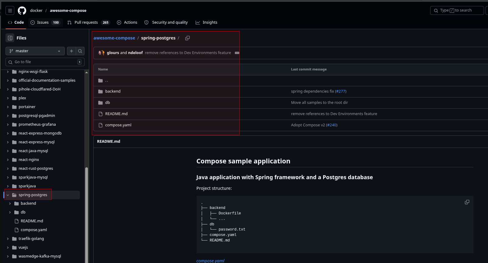

---

## 2. Configuración del Entorno de Control de Versiones (ALM)

Una vez clonado el código base, se configuró un proyecto en **Azure DevOps** para gestionar el ciclo de vida completo del software (ALM).

### Pasos de configuración:

1. Se creó un proyecto en Azure DevOps llamado `digitalprof`
2. El código fue importado y almacenado en la sección de **Repos**
3. Se configuró un agente self-hosted local para ejecutar las tareas de compilación

El repositorio en Azure DevOps permite gestionar el código fuente, los pipelines de CI/CD y los artefactos de construcción de manera centralizada.

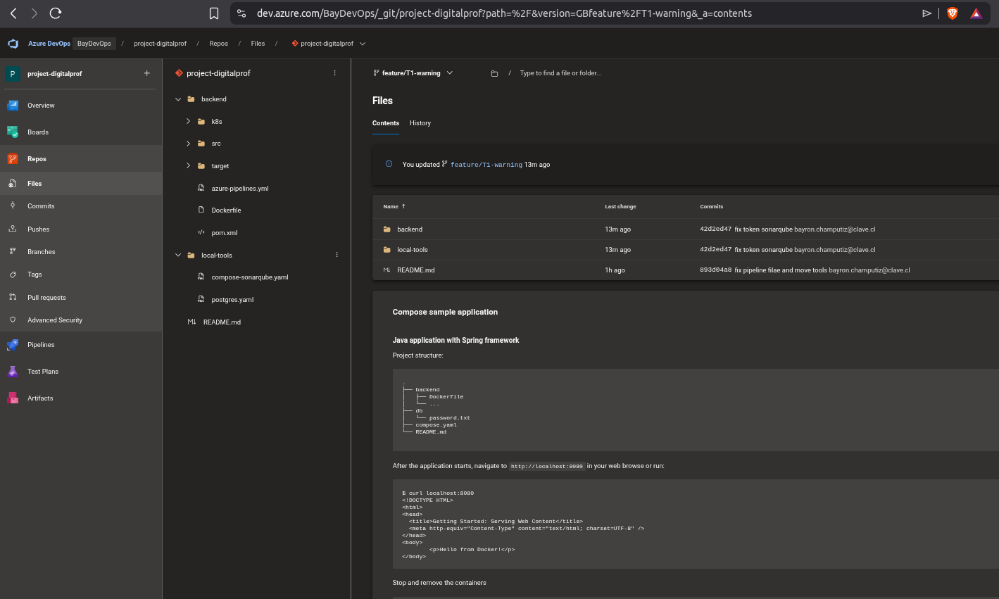

---

## 3. Estructura del Repositorio

El repositorio está organizado de la siguiente manera:

```
project-digitalprof/
├── backend/                  # Código fuente de la aplicación
│   ├── src/
│   │   ├── main/
│   │   │   ├── java/com/company/project/
│   │   │   │   ├── Application.java
│   │   │   │   ├── controllers/HomeController.java
│   │   │   │   ├── entity/Greeting.java
│   │   │   │   └── repository/GreetingRepository.java
│   │   │   └── resources/
│   │   │       ├── application.properties
│   │   │       ├── schema.sql
│   │   │       ├── data.sql
│   │   │       └── templates/home.ftlh
│   │   └── test/
│   ├── target/               # Artefactos de compilación
│   ├── pom.xml               # Configuración Maven
│   ├── Dockerfile            # Imagen Docker de la aplicación
│   ├── azure-pipelines.yml   # Definición del pipeline CI/CD
│   └── k8s/                  # Manifiestos Kubernetes
│       ├── deployment.yaml
│       ├── service.yaml
│       └── ingress.yaml
├── local-tools/              # Herramientas de apoyo local
│   ├── compose-sonarqube.yaml
│   └── postgres.yaml
├── .gitignore
├── .dockerignore
└── README.md
```

### Directorio /backend

Contiene el núcleo de la aplicación Java/Spring Boot:

- **Controladores**: Endpoints REST y vistas HTML
- **Entidades**: Modelos de datos (Greeting)
- **Repositorios**: Acceso a datos con Spring Data JPA
- **Recursos**: Configuración y plantillas

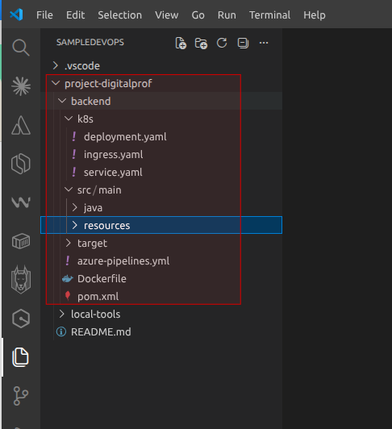

### Directorio /local-tools

Almacena las configuraciones de herramientas de apoyo para el entorno de desarrollo local:

- **compose-sonarqube.yaml**: Definición de SonarQube para análisis de código
- **postgres.yaml**: Configuración de PostgreSQL para pruebas locales

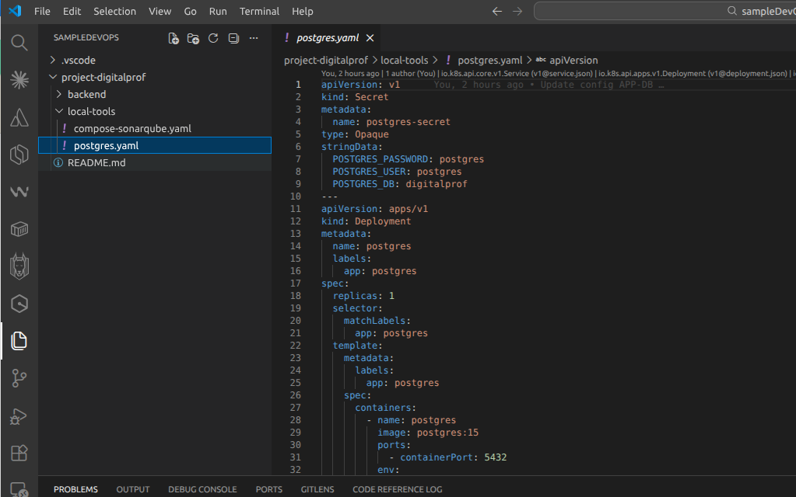

---

## 4. Integración Continua (CI) y Pipeline

El pipeline de CI/CD está definido en `/backend/azure-pipelines.yml` y contempla las siguientes etapas:

### Etapas del Pipeline

1. **Build**: Compilación y pruebas unitarias con Maven
2. **SonarQube Analysis**: Análisis estático de código
3. **Docker**: Construcción y push de imagen Docker
4. **DeployK8s**: Despliegue en Minikube

### Etapa Docker: Construcción y Publicación de Imagen

La etapa **Docker** es responsable de construir la imagen de la aplicación y publicarla en Docker Hub. Esta etapa se ejecuta después de que el código pasa el análisis de calidad de SonarQube.

#### Proceso de Construcción

1. **Conexión a Minikube Docker Engine**: El pipeline se conecta al daemon Docker de Minikube para construir la imagen localmente:
   ```bash
   eval $(minikube -p minikube docker-env)
   ```

2. **Build de la Imagen**: Se construye la imagen Docker utilizando el Dockerfile ubicado en `/backend/Dockerfile`:
   ```bash
   docker build -t dockerbayron/demo_digitalprof:latest backend/
   ```

3. **Tag y Push a Docker Hub**: La imagen se etiqueta y se sube al repositorio público de Docker Hub:
   ```bash
   docker tag dockerbayron/demo_digitalprof:latest dockerbayron/demo_digitalprof:latest
   docker push dockerbayron/demo_digitalprof:latest
   ```

#### Configuración de la Imagen

La imagen Docker se configura con los siguientes parámetros:

- **Imagen base**: `openjdk:11-jre-slim` (Java 11 Runtime)
- **Puerto expuesto**: `8080`
- **Usuario**: `root`
- **Variables de entorno**: Configuradas para conectar con PostgreSQL en el clúster

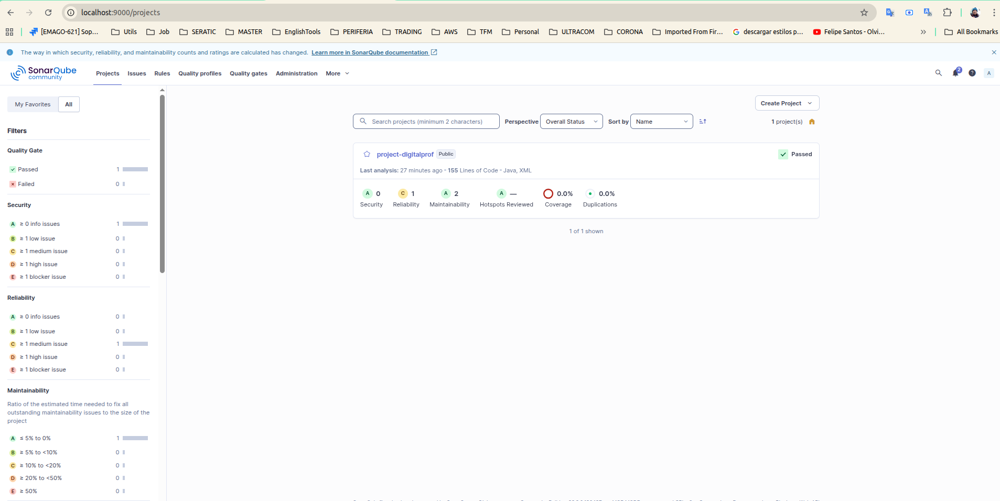

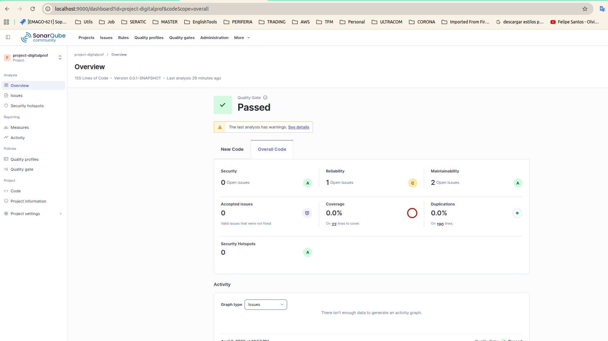

```yaml
stages:
  - stage: Build
    # Compilación Maven y tests
  - stage: SonarQube
    # Análisis de calidad de código
  - stage: Docker
    # Build y push de imagen
  - stage: DeployK8s
    # Despliegue en Kubernetes
```

en el stage **Docker** se utiliza el agente para construir la imagen docker y subirla a la cuenta personal de dockerhub como se observa en las siguientes imagenes
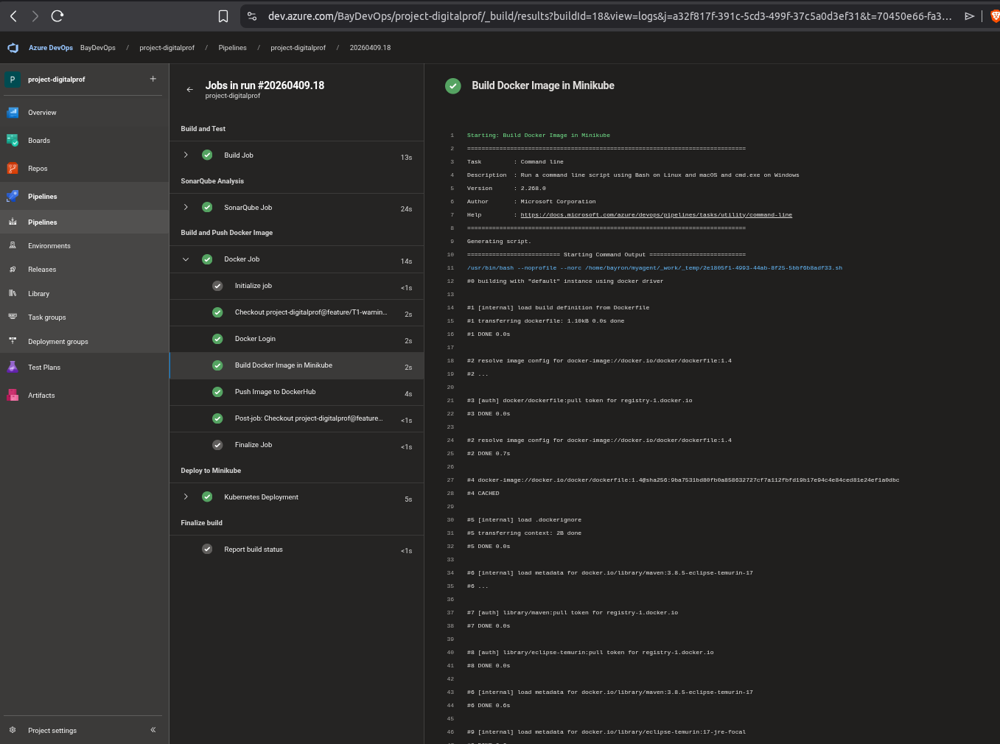
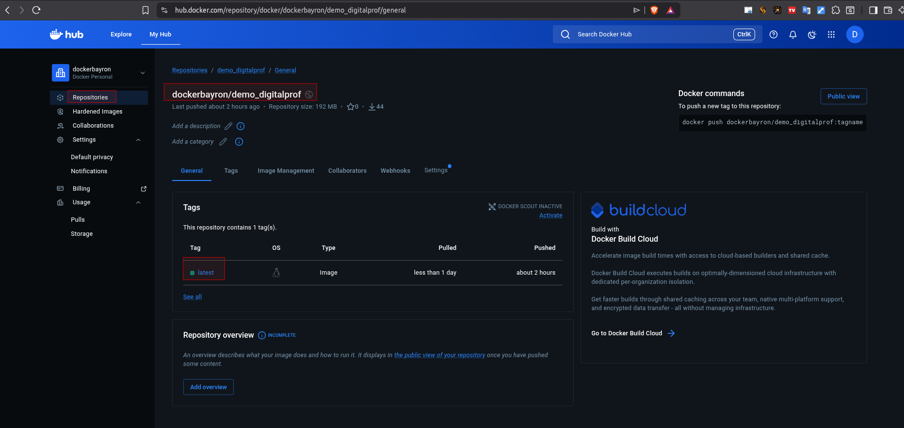

### Agente de Compilación (Self-hosted Agent)

Se utiliza un **Self-hosted Agent** configurado localmente para ejecutar las tareas de compilación, análisis y despliegue. Este agente está registrado en Azure DevOps y ejecuta las jobs en un clúster Minikube local.

El agente permite:
- Ejecutar tareas de compilación Maven
- Construir imágenes Docker dentro del entorno Minikube
- Aplicar manifiestos Kubernetes directamente al clúster

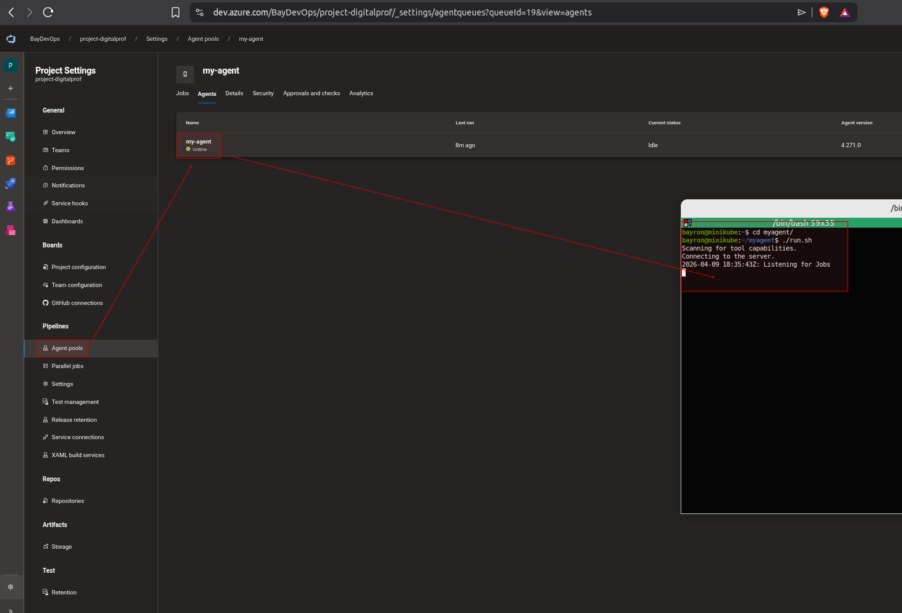

### Seguridad

Las credenciales y secretos se gestionan mediante **Variable Groups** protegidos en Azure DevOps:

- `sonarToken`: Token de autenticación para SonarQube
- `dockerPassword`: Credencial de Docker Hub
- `dockerUsername`: Usuario de Docker Hub

Estos valores se almacenan de forma segura y se injectan como variables de entorno durante la ejecución del pipeline.

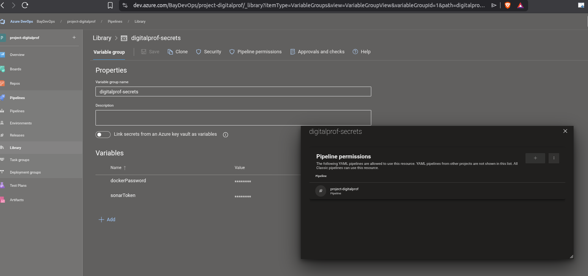

---

## 5. Análisis de Calidad con SonarQube

### Despliegue de SonarQube

Se despliega un servidor SonarQube local mediante Docker Compose utilizando el archivo `/local-tools/compose-sonarqube.yaml`.

```bash
cd local-tools
docker-compose -f compose-sonarqube.yaml up -d
```

Acceso a SonarQube: `http://localhost:9000`

### Escenario: Análisis Exitoso

En el flujo normal de CI, el análisis de SonarQube se completa exitosamente:

1. El pipeline ejecuta `mvn sonar:sonar`
2. Se analiza el código en busca de code smells, bugs y vulnerabilidades
3. El Quality Gate evalúa los resultados
4. Si todo es conforme, el pipeline continúa

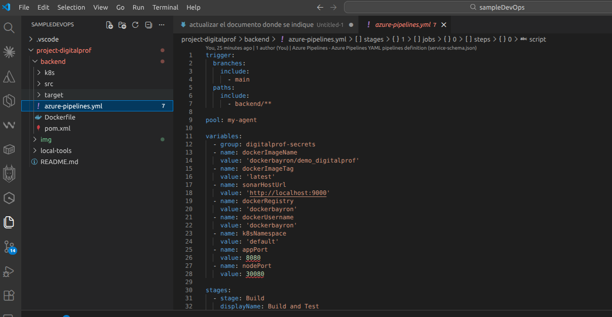

### Escenario: Prueba de Calidad (Quality Gate Fallido)

Para demostrar la importancia del Quality Gate, se insertó intencionalmente **deuda técnica** y **código duplicado** en `HomeController.java`:

- **Complejidad ciclomática elevada**: Método `testMethod` con múltiples condicionales anidados
- **Código duplicado**: Métodos `duplicate1`, `duplicate2`, `duplicate3` con lógica repetida

```java
@GetMapping("/duplicate1")
public String duplicate1(Model model) {
    String result = "";
    for (int i = 0; i < 10; i++) {
        result += "a";
    }
    // ... código repetido
}
```

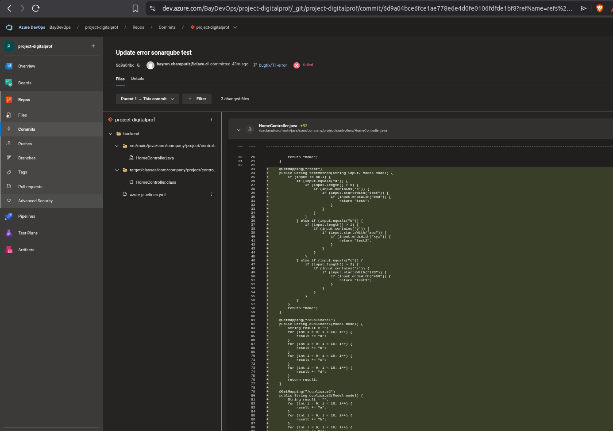

Cuando se ejecuta el pipeline con este código, SonarQube detecta las violaciones:

- **Code Smells**: Complejidad excesiva
- **Duplicación**: Bloques de código repetidos

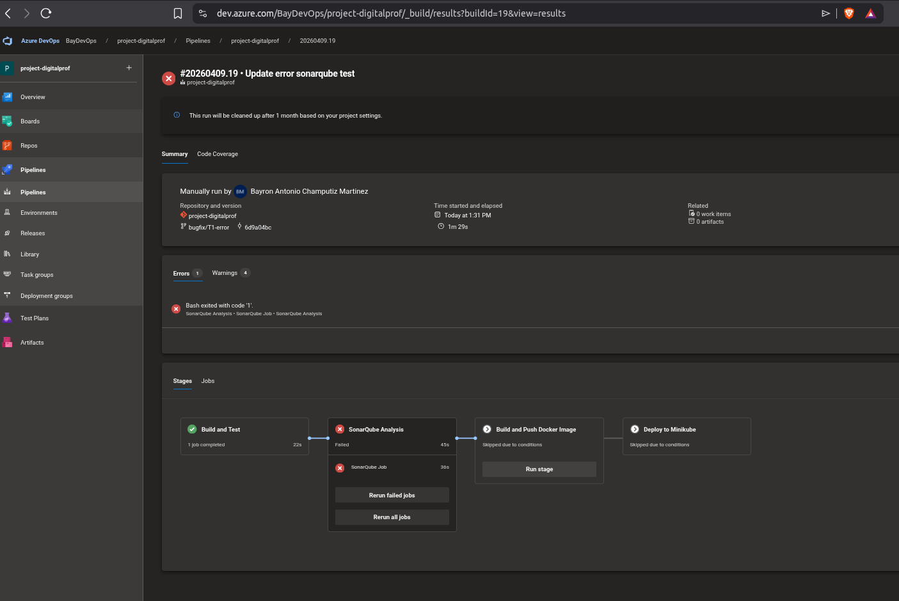

El Quality Gate marca el análisis como **FAILED** y el pipeline se detiene, impidiendo el despliegue de código de baja calidad.

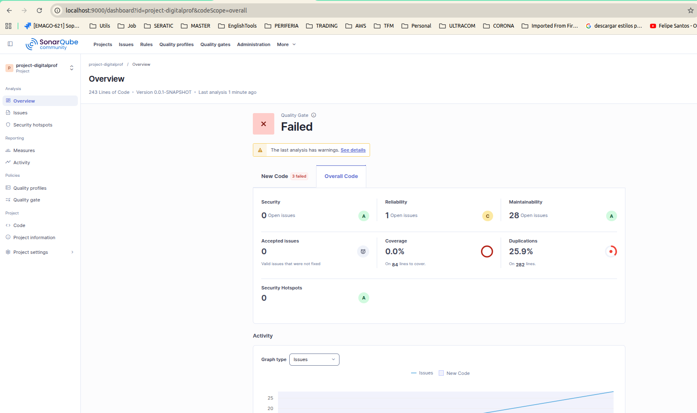

---

## 6. Despliegue y Exposición del Servicio

### Aplicación en Ejecución

Una vez desplegada la aplicación en el clúster Minikube, la aplicación Java/Spring Boot está corriendo y lista para atender solicitudes.

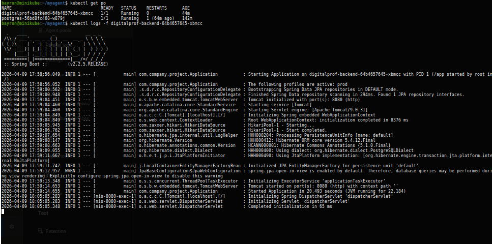

### Ingress Controller

Se configuró **Nginx Ingress** para exponer el servicio externamente. El archivo de configuración `/backend/k8s/ingress.yaml` define las reglas de enrutamiento:

```yaml
apiVersion: networking.k8s.io/v1
kind: Ingress
metadata:
  name: digitalprof-ingress
  annotations:
    nginx.ingress.kubernetes.io/rewrite-target: /
spec:
  ingressClassName: nginx
  rules:
    - host: digitalprof.local
      http:
        paths:
          - path: /
            pathType: Prefix
            backend:
              service:
                name: digitalprof-backend
                port:
                  number: 8080
```

Habilitar Ingress en Minikube:
```bash
minikube addons enable ingress
```

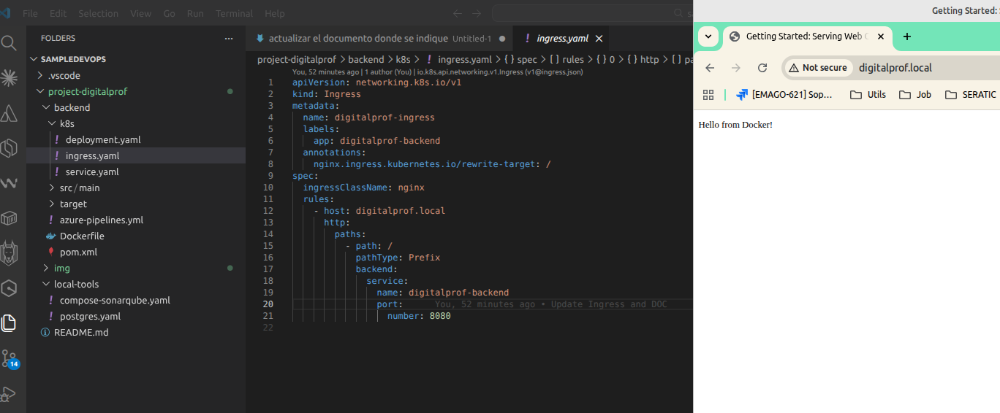

### Acceso desde Minikube

Forma de acceder al servicio:

1. **Directo (NodePort)**:
   ```
   http://192.168.49.2:30080
   ```

2. **Via Ingress** (agregar al `/etc/hosts`):
   ```
   192.168.49.2 digitalprof.local
   http://digitalprof.local
   ```

### Túnel de Acceso Público (cloudflared)

Para exponer el servicio de Minikube a Internet de forma segura, se utiliza **cloudflared** (Cloudflare Tunnel). Esto permite que el servicio sea accesible públicamente sin configuración de IP externa.

El túnel se configura conectando el servicio local a la infraestructura de Cloudflare, creando un dominio público temporal.

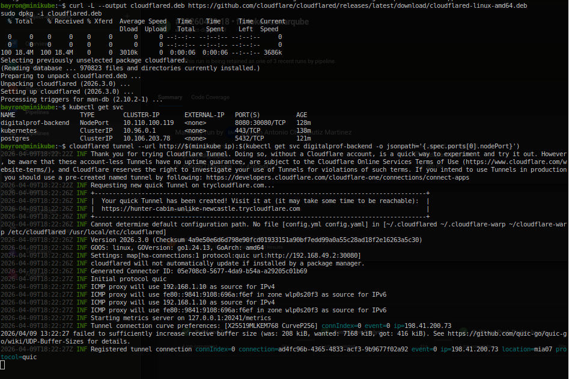

---

## 7. Repositorio Público

El código fuente final del proyecto está disponible en el repositorio público de GitHub:

**URL:** [https://github.com/edixred/project-digitalprof](https://github.com/edixred/project-digitalprof)

Este repositorio contiene:
- Código completo de la aplicación Java/Spring Boot
- Definiciones de Kubernetes (Deployment, Service, Ingress)
- Pipeline de Azure DevOps
- Configuración de herramientas locales (SonarQube, PostgreSQL)
- Documentación completa

---

## Resumen de la Arquitectura

```
┌─────────────────────────────────────────────────────────────────┐
│                        Azure DevOps                             │
│  ┌──────────────┐  ┌──────────────┐  ┌───────────────────────┐  │
│  │    Repo      │  │   Pipeline   │  │  Variable Groups     │  │
│  │  (Código)    │──│ (CI/CD)      │──│  (Secrets)          │  │
│  └──────────────┘  └──────────────┘  └───────────────────────┘  │
└─────────────────────────────────────────────────────────────────┘
                              │
                              ▼
┌─────────────────────────────────────────────────────────────────┐
│                   Self-hosted Agent (Minikube)                  │
│  ┌──────────────┐  ┌──────────────┐  ┌───────────────────────┐  │
│  │ Build Maven  │  │ SonarQube    │  │ Docker Build         │  │
│  │ + Tests      │──│ Analysis     │──│ + Push               │  │
│  └──────────────┘  └──────────────┘  └───────────────────────┘  │
└─────────────────────────────────────────────────────────────────┘
                              │
                              ▼
┌─────────────────────────────────────────────────────────────────┐
│                    Minikube (Kubernetes)                        │
│  ┌──────────────┐  ┌──────────────┐  ┌───────────────────────┐  │
│  │ Deployment  │  │   Service    │  │      Ingress          │  │
│  │ (Backend)   │──│ (ClusterIP)  │──│   (Nginx)             │  │
│  └──────────────┘  └──────────────┘  └───────────────────────┘  │
│  ┌──────────────┐                                               │
│  │   Postgres   │                                               │
│  └──────────────┘                                               │
└─────────────────────────────────────────────────────────────────┘
                              │
                              ▼
┌─────────────────────────────────────────────────────────────────┐
│                    Acceso Externo                               │
│  ┌──────────────┐  ┌─────────────────────────────────────────┐ │
│  │ cloudflared  │──│  https://hunter-cabin-unlike-newcastle   │ │
│  │  (Tunnel)    │  │         .trycloudflare.com              │ │
│  └──────────────┘  └─────────────────────────────────────────┘ │
└─────────────────────────────────────────────────────────────────┘
```

---

**Autor:** Bayron Antonio Champutiz
**Tecnologías:** Java, Spring Boot, Maven, Docker, Kubernetes, Minikube, Azure DevOps, SonarQube, Nginx Ingress, cloudflared
